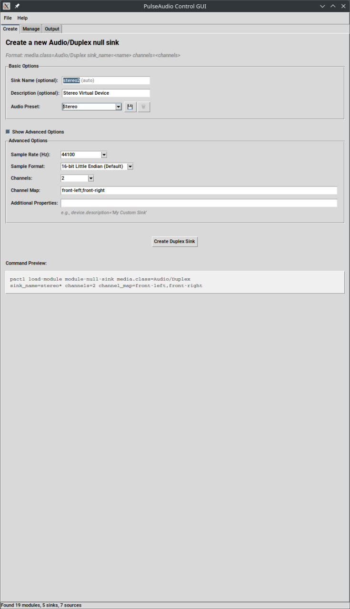
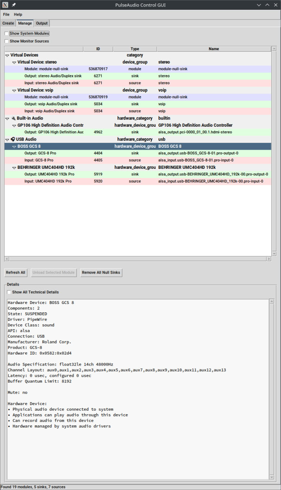
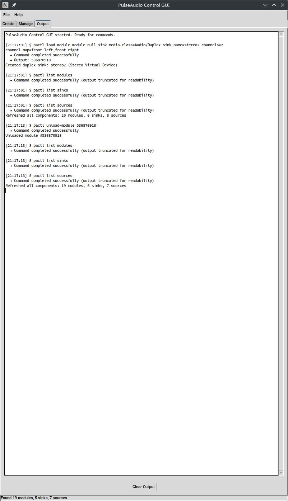

# PulseAudio/PipeWire Control GUI (pactl-gui)

A lightweight graphical user interface for managing audio modules and configurations on PulseAudio and PipeWire systems.

## Project Overview

PulseAudio/PipeWire Control GUI provides a simple, user-friendly interface for common audio management tasks that would otherwise require command-line expertise. The application works with both PulseAudio and PipeWire systems, focusing on managing audio modules, creating virtual devices, and setting up audio routing configurations for specific use cases.

## Current Features (MVP)

- **Sink/Source Management**: View all PulseAudio sinks and sources with details
- **Duplex Sink Creation**: Create duplex sinks with custom names and channel configurations
- **Module Management**: View and unload PulseAudio modules
- **Basic Preset Saving**: Save current configuration as a preset
- **Command Output Display**: View the results of PulseAudio operations

## Screenshots

### Main Interface


### Device Management
Organized hardware device grouping with individual device controls:


### Command Logging
Real-time command execution tracking and output:


## Future Features

- **Preset Loading**: Load saved configurations
- **Terminal Integration**: Execute custom PulseAudio commands with real-time feedback
- **Advanced Configuration Options**: More detailed module configurations
- **Visual Audio Routing**: Visualize and modify audio connections

## Target Users

- Linux gaming enthusiasts who need special audio configurations
- Content creators who require complex audio routing
- Audio professionals working with virtual devices
- Regular users who find PulseAudio CLI commands intimidating

## Design Philosophy

The application adheres to the following principles:

1. **Lightweight**: Minimal dependencies and system resource usage
2. **User-Friendly**: Simple interface that abstracts complex commands
3. **Powerful**: Provide access to full PulseAudio functionality
4. **Educational**: Help users understand PulseAudio concepts

## Technology Stack

- **Frontend**: Python with Tkinter (minimal dependencies)
- **Backend**: Direct interaction with PulseAudio via `pactl` commands

## Getting Started

### Prerequisites

- Python 3.6+
- **Either** PulseAudio OR PipeWire audio system (most modern Linux distributions include one of these)
- Tkinter (Python's standard GUI package)

**Note**: This application works with both PulseAudio and PipeWire systems. Most modern Linux distributions come with either PulseAudio or PipeWire already installed and configured. You typically don't need to install additional audio system packages.

### Installing Dependencies

#### Python and Tkinter
The main dependencies you may need to install are Python 3 and Tkinter:

**Python 3**: Usually pre-installed on most Linux distributions. Check with:
```bash
python3 --version
```

**Tkinter**: Usually included with Python, but may need separate installation:
```bash
# Debian/Ubuntu
sudo apt-get install python3-tk

# Fedora
sudo dnf install python3-tkinter

# openSUSE
sudo zypper install python313-tk  # Replace 313 with your Python version

# Arch Linux
sudo pacman -S tk
```

#### Audio System Compatibility
This application works with:
- **PulseAudio**: Uses `pactl` commands (widely supported)
- **PipeWire**: Compatible through PulseAudio compatibility layer

**Checking your audio system**:
```bash
# Check if pactl is available (should work on both systems)
which pactl

# Check what audio system you're running
systemctl --user status pulseaudio pipewire-pulse
```

**If pactl is missing** (rare on modern systems):
```bash
# Debian/Ubuntu
sudo apt-get install pulseaudio-utils

# Fedora
sudo dnf install pulseaudio-utils

# openSUSE
sudo zypper install pulseaudio-utils

# Arch Linux
sudo pacman -S pulseaudio
```

### Installation

There are two ways to install PulseAudio Control GUI:

#### Option 1: Automatic Installation (Recommended)

1. Clone the repository:
```bash
git clone https://github.com/Skrappjaw/pactl-gui.git
cd pactl-gui
```

2. Run the installation script:
```bash
./install.sh
```

The installer will:
- Check for all required dependencies
- Install the application to your user directory (`~/.local/share/pactl-gui`)
- Create a command-line launcher (`pactl-gui` command)
- Add a desktop entry for your application menu
- Provide helpful feedback and error messages

3. Launch the application:
- From your application menu: **Audio → PulseAudio GUI**
- From terminal: `pactl-gui`

#### Option 2: Manual Installation

If you prefer to run directly from the source directory:

```bash
# Clone the repository
git clone https://github.com/Skrappjaw/pactl-gui.git
cd pactl-gui

# Run the application directly
python3 src/main.py
```

#### Uninstallation

To remove the application completely:
```bash
# If installed with install.sh:
~/.local/share/pactl-gui/uninstall.sh

# Or use the uninstall script from the source directory:
./uninstall.sh
```

### Usage

The application is organized into tabs:

1. **Create**: Create new duplex sinks with custom names and channel configurations
2. **Manage**: View and manage existing sinks, sources, and modules
3. **Output**: View the output of audio system commands

#### Creating a Duplex Sink

1. Go to the "Create" tab
2. Enter a unique name for the sink (no spaces, used as internal identifier)
3. Enter a human-readable description (shown in audio controls)
4. Select the number of channels (1=mono, 2=stereo, etc.)
5. Click "Create Duplex Sink"

#### Managing Modules

1. Go to the "Manage" tab
2. View the list of loaded modules
3. Select a module and click "Unload Selected Module" to remove it

#### Saving Presets

1. Go to the "File" menu
2. Select "Save Preset..."
3. Enter a name for the preset

## Project Status

Currently in early development with basic MVP functionality implemented.

## License

[MIT License](LICENSE)

## Contributing

Contributions are welcome! See [CONTRIBUTING.md](CONTRIBUTING.md) for details on how to get involved.